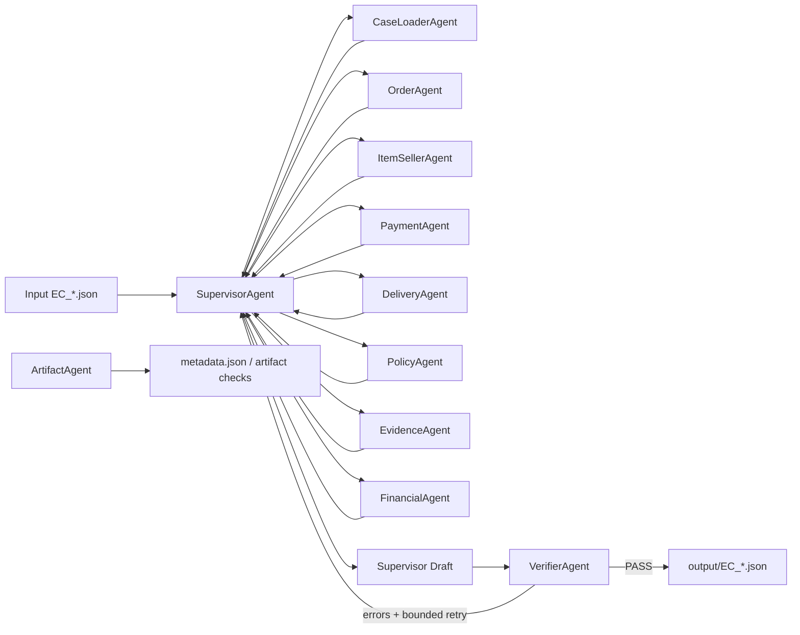

# Olist Multi-Agent Dispute Resolution — Architecture

## 1. Tổng quan

Hệ thống xử lý deterministic 50 khiếu nại theo `EC_POLICY_V1`. Mỗi agent sở hữu một domain, trao đổi dataclass có cấu trúc và trả kết quả về `SupervisorAgent`. Không dùng nội dung khiếu nại làm ground truth, không gọi LLM, không tạo dữ liệu ngoài CSV. Chỉ output đã qua `VerifierAgent` mới được ghi atomically.

## 2. Sơ đồ agent



## 3. Vai trò

- `SupervisorAgent`: lập kế hoạch, dispatch song song, nhận handoff, dựng draft, retry có giới hạn và ghi output sau PASS; không query CSV và không tự phân loại.
- `CaseLoaderAgent`: đọc/kiểm tra đúng case, filename và policy version; không phân tích nghiệp vụ.
- `OrderAgent`: orders/customers và biểu diễn rõ field null.
- `ItemSellerAgent`: toàn bộ item/seller, tổng thô và seller handoff sau hạn.
- `PaymentAgent`: mọi payment row, tổng payment, delta, tolerance 0.10 và split-payment.
- `DeliveryAgent`: so sánh trực tiếp timestamp CSV, tách seller-late/logistics-late/on-time.
- `PolicyAgent`: first-match theo đúng sáu rule, lỗi có cấu trúc khi không match.
- `EvidenceAgent`: tạo tối đa 10 ID từ năm namespace hợp lệ.
- `FinancialAgent`: tính lại tất cả tiền bằng `Decimal`, làm tròn hai chữ số.
- `VerifierAgent`: độc lập chạy schema, enum, cardinality, referential, business, financial, confidence và evidence gates.
- `ArtifactAgent`: metadata runtime, kiểm tra tài liệu/trace; không quyết định case.

## 4. Data-access matrix

| Agent | Input/CSV được phép | Không truy cập |
|---|---|---|
| CaseLoader | một JSON input | mọi CSV |
| Order | orders; customers khi cần unique ID | items, payments, policy decision |
| ItemSeller | order_items; sellers qua existence API | payments, customers |
| Payment | order_payments; item/freight totals dạng facts | orders, sellers |
| Delivery | `OrderFacts`, `ItemSellerFacts` | CSV trực tiếp |
| Policy | facts chuẩn hóa | CSV trực tiếp |
| Evidence | facts + decision; verifier kiểm tra repository | không tạo ledger/tracking |
| Financial | item/payment facts + decision | CSV trực tiếp |
| Verifier | input, facts, row-existence APIs, draft | không dùng PolicyAgent |
| Supervisor | structured messages | không query CSV |
| Artifact | run-level artifacts | facts nghiệp vụ |

Bốn CSV geolocation, reviews, products và translation được kiểm tra sự hiện diện/schema nhưng không tải vào business path vì `EC_POLICY_V1` không dùng chúng.

## 5. Handoff flow

`CaseLoader` chạy trước. `Order`, `ItemSeller` và bước load của `Payment` chạy đồng thời qua `ThreadPoolExecutor`; sau đó ItemSeller đánh dấu handoff và Payment reconcile trên totals. `Delivery` → `Policy`; `Evidence` và `Financial` tiếp tục song song. Supervisor dựng schema tối giản và gửi toàn bộ facts/draft sang Verifier. Nếu fail, trace ghi errors/retry/target; tối đa ba attempt, sau đó dừng rõ ràng.

## 6. Message contract

Mỗi handoff dùng `AgentMessage`: `message_id`, `case_id`, `sender`, `recipient`, `task`, `status`, `input_refs`, `payload`, `errors`, `started_at`, `completed_at`. Payload trace chỉ chứa summary facts có cấu trúc; dataclass đầy đủ được truyền trong process, không truyền DataFrame hoặc free text làm nguồn dữ liệu chính.

## 7. Retry và error handling

Exception của agent tạo result `failed` rồi dừng case. Validation error được phân tuyến theo prefix (`policy`, `financial`, `evidence`, `schema`, …), re-dispatch agent liên quan và dựng lại dependency. Output dùng temp file + `os.replace`; case fail không ghi file cuối. Retry tối đa ba lần.

## 8. Determinism strategy

Case xử lý theo `case_id`; item/payment sort theo numeric sequence; set được sort hoặc giữ insertion order; policy là first-match cố định; timestamp so sánh nguyên văn; tiền dùng `Decimal`; JSON cấm NaN/Infinity. Trace mới luôn truncate trước run. Output không phụ thuộc ngẫu nhiên hay nội dung claim.

## 9. Evidence strategy

Chỉ dùng `order:`, `item:`, `payment:`, `seller:` và `policy:`. Canceled/unavailable cần order + payment + policy. Delivery cần order + item/payment liên quan + seller chịu trách nhiệm nếu seller-late + policy. Split/on-time cần order + item/payment + policy. Loại duplicate, giới hạn 10, và Verifier tra tồn tại từng row.

## 10. Validation gates

Verifier kiểm exact schema/type; allowlist enums; limits 5/10/3/3/5; raw entity format; row existence; tự chạy policy theo priority; tự tính tiền/refund; status/refund consistency; confidence deterministic; evidence format/existence/relevance. `scripts/validate_outputs.py` còn kiểm đúng tập 50 filename, artifacts, metadata và trace.

## 11. Trace format

`trace.jsonl` chứa một JSON object mỗi dòng: run/case lifecycle, dispatch, start, structured result, handoff, verifier errors, retry, pass, atomic write và summary. Writer thread-safe. Không ghi secret, `.env`, customer message đầy đủ hoặc chain-of-thought.

## 12. Security và secret management

Runtime không cần network/API key. `.env`, virtualenv, cache, temp và `.DS_Store` bị ignore. Source không đọc `.env`; trace không serialize môi trường hoặc secrets. Input/CSV chỉ đọc.

## 13. Model information

`MODEL_NAME = deterministic-python-rules-v1`, parameter size `0B (no LLM)`, local provider. Đây là mô tả trung thực: policy và validation là Python deterministic, dưới giới hạn 10B; không tuyên bố dùng model sinh ngôn ngữ.

## 14. Cách chạy

```bash
python3 -m unittest discover -s tests -v
python3 scripts/run_all.py
python3 scripts/validate_outputs.py
```

## 15. Cách test

20 test bao phủ sáu rule, tolerance 0.10, zero item, multi-item/payment, evidence format/existence, cardinality, confidence, financial/status, schema/enum, priority và trace overwrite. Full validator tái dựng facts từ CSV độc lập cho cả 50 case.

## 16. Đóng gói submission

```bash
python3 scripts/package_submission.py
unzip -l output.zip
```

Script từ chối package khi validator fail. Theo định dạng đã được portal xác nhận, ZIP có entry `output/` và đúng 50 child entries `output/EC_001.json`…`output/EC_050.json`; không chứa artifact hoặc file khác.
